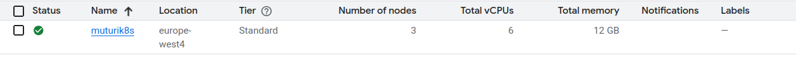
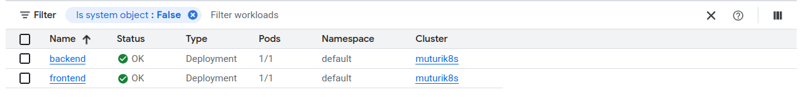

# Project walkthrough
1. Set up Cluster in GCP


2. Create manifest
```
1. backend
    - create a deployment app setting up the following
        - image
        - container name
        - exposing ports for container
        - setting environment variable
2. frontend
    - create a deoployment app 
    - image
    - container name
    - exposing ports for container
```

2. Create Services for each module that id backend and backend
